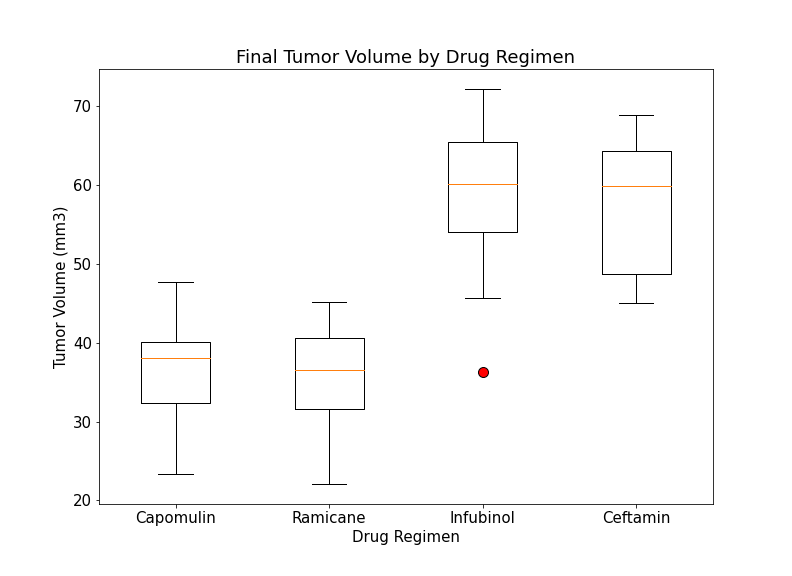

# Pymaceuticals Cancer Treatment Study

## Overview
The purpose of this project was to analyze results of an animal study conducted by Pymaceuticals (a mock-up pharmaceutical company) on potential treatments for squamous cell carcinoma. Summary tables and figures were created using Python, Pandas, and Matplotlib to compare the performance of Pymaceuticals' Capomulin to other treatment regimens. 

## Description of the Data: Mouse_metadata and Study_results
The metadata for all 249 mice included in the study are contained in a csv file called "_Mouse_metadata_". The dataset is organized into five columns: 
- **Mouse ID** - the unique ID number for each mouse 
- **Drug Regimen** - the drug treatment assigned to each mouse (Capomulin, Placebo, or one of 8 other drug regimens)
- **Sex** - the sex of each mouse (Male or Female)
- **Age_months** - the age of each mouse, measured in months
- **Weight (g)** - The weight of each mouse, measured in grams 

The data for the results of the drug trials are contained in a csv file called "_Study_results_". The dataset is organized into four columns:
- **Mouse ID** - the unique ID number for each mouse 
- **Timepoint** - the timepoint in which the data was taken (0, 5, 10, 15, 20, 25, 30, 35, 40, and 45). Going down the rows, the data is organized chronologically such that all of the results from each timepoint are grouped together going from time 0 to time 45. 
- **Tumor Volume (mm3)** - the tumor volume for each mouse, measured at each timepoint in cubic millimeters 
- **Metastatic Sites** - the number of metastative sites for each mouse at each timepoint

## Results 
The Jupyter Notebook used for data cleaning and and visualization can be found in [pymaceuticals_final.ipynb](/Pymaceuticals/Analysis/pymaceuticals_final.ipynb).

The data from _Mouse_metadata_ and _Study_results_ was merged into one master dataset. One duplicate Mouse ID was found and all corresponding data was removed before analysis. 

The following summary tables and figures highlight key trends from the study:

> The above table provides a summary of the mean, median, variance, standard deviation, and standard error from the mean (SEM) of the tumor volume for each drug treatment across all timepoints.

 
> As the above bar chart shows, Capomulin and Ramicane had the greatest number of mice still alive by the end of the study.

> The proportions of female and male mice included in the study were almost equal.

> Between Capomulin, Ramicane, Infubinol, and Ceftamin, Ramicane had the lowest median tumor volume by the end of the study, followed closely by Capomulin.

> As demonstrated by the above line graph, Capamulin was shown to be an effective treatment for squamous cell carcinoma, cutting tumor volume for this mouse by about 50% over the course of the study.

> There seemed to be a strong positive correlation (r=.84) between the initial weight of the mice and the average tumor volume over the course of the study. Initial weight may have an impact on the effectiveness of Capomulin on reducing tumor volume.

## Summary
Based on the results of this animal study, Ramicane and Pymaceuticals' Capamulin seem to be the most promising treatment regimens for squamous cell carcinoma, with mice in both treatments having the lowest median tumor volumes by the trial's end. Capamulin specifically was shown to have the potential to reduce tumor volume by about 50% over time. However, as mouse weight and tumor volume were strongly correlated (r=.84), future analysis should explore further to determine whether weight impacts the drug's effectiveness. 

## Contact
**Angela Angulo** -- anguloag@vcu.edu
